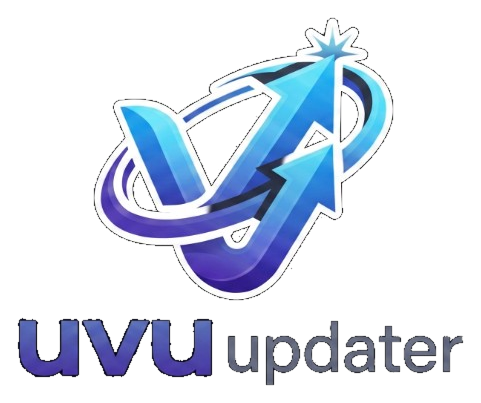

# uvu

[](https://pypi.org/project/uvu/)
[](https://pypi.org/project/uvu/)
[](./LICENSE)
[](https://github.com/astral-sh/ruff)

A clean standalone Python utility and library to check and update `uv`-managed project dependencies with optional target pinning back to your `pyproject.toml`.

## Features
* **Workspace Support**: Resolves standalone projects or complex `uv` workspaces interactively or via CLI flags.
* **Direct vs Transitive Identification**: Inspects which dependencies are direct in your packages and which are transitive.
* **Pyproject Pinning**: Automatically updates version constraints in `pyproject.toml` files to match the new `uv.lock` values.
* **Safe TOML Handling**: Error-resilient TOML reader with useful CLI messaging.
* **Modern Integration**: Integrates directly with the `uv` toolchain (`uv lock`, `uv sync`).

## Installation

Install via pip or run directly using `uv`:

```bash
pip install uvu
```

Or run on-the-fly:
```bash
uvx uvu check
```

## CLI Usage

You can use the short command `uvu` or the full command `update-uv-packages`.

### Check available updates

Check for updates across the project:
```bash
uvu check
```

**Example output:**
```text
Project: /path/to/project
Locked packages: 8 (3 direct in scope, 5 transitive)
Available compatible updates (4)
  #  package    locked    latest    role
---  ---------  --------  --------  -------------------------
  1  click      8.0.1     8.4.2     direct (demo-app/project)
  2  idna       2.10      3.18      transitive
  3  requests   2.25.1    2.27.1    direct (demo-app/project)
  4  urllib3    1.26.15   1.26.20   direct (demo-app/project)

Outdated packages blocked by constraints (1)
  #  package    locked    latest    role        blocked by
---  ---------  --------  --------  ----------  --------------------
  1  chardet    4.0.0     7.4.3     transitive  required by requests
```

Check for updates and also list packages that are already up to date:
```bash
uvu check --verbose
```

**Example output:**
```text
Project: /path/to/project
Locked packages: 8 (3 direct in scope, 5 transitive)
Available compatible updates (4)
  #  package    locked    latest    role
---  ---------  --------  --------  -------------------------
  1  click      8.0.1     8.4.2     direct (demo-app/project)
  2  idna       2.10      3.18      transitive
  3  requests   2.25.1    2.27.1    direct (demo-app/project)
  4  urllib3    1.26.15   1.26.20   direct (demo-app/project)

Outdated packages blocked by constraints (1)
  #  package    locked    latest    role        blocked by
---  ---------  --------  --------  ----------  --------------------
  1  chardet    4.0.0     7.4.3     transitive  required by requests

Up to date (3)
  certifi==2026.6.17 (transitive)
  colorama==0.4.6 (transitive)
  demo-app==0.1.0 (transitive)
```

### Apply updates

Apply updates to specific packages or all packages:
```bash
# Update all available packages
uvu update --all

# Update specific packages
uvu update --packages requests urllib3

# Update and pin modified dependency versions back to pyproject.toml
uvu update --packages urllib3 click --pin-updated
```

**Example output for `uvu update --packages urllib3 click --pin-updated`:**
```text
Project: /path/to/project
Locked packages: 8 (3 direct in scope, 5 transitive)
Available compatible updates (4)
  #  package    locked    latest    role
---  ---------  --------  --------  -------------------------
  1  click      8.0.1     8.4.2     direct (demo-app/project)
  2  idna       2.10      3.18      transitive
  3  requests   2.25.1    2.27.1    direct (demo-app/project)
  4  urllib3    1.26.15   1.26.20   direct (demo-app/project)

Outdated packages blocked by constraints (1)
  #  package    locked    latest    role        blocked by
---  ---------  --------  --------  ----------  --------------------
  1  chardet    4.0.0     7.4.3     transitive  required by requests

Update report
=============
package    before    after
---------  --------  -------
click      8.0.1     8.4.2
urllib3    1.26.15   1.26.20

pyproject.toml pins
member    group    package    requirement
--------  -------  ---------  ----------------
demo-app  project  urllib3    urllib3==1.26.20
demo-app  project  click      click==8.4.2
```

## Programmatic API Usage

You can import and orchestrate updates directly inside other Python scripts:

```python
from pathlib import Path
from uvu import UVDependencyManager

# Initialize the manager pointing to your project
manager = UVDependencyManager(start_dir=Path("/path/to/project"))

# Bootstrap layout and workspace members
# (Pass an empty Namespace or CLI args to control options)
import argparse
args = argparse.Namespace(all_members=True, yes=True)
manager.bootstrap(args=args)

# Discover updates
updates = manager.discover_updates()
for update in updates:
    print(f"{update.name}: {update.current} -> {update.latest}")
```
